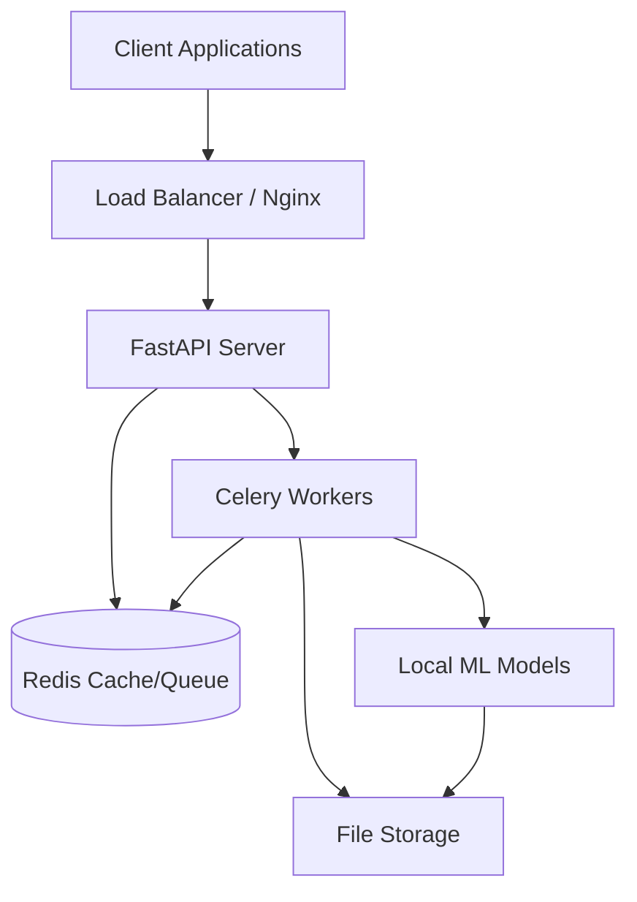
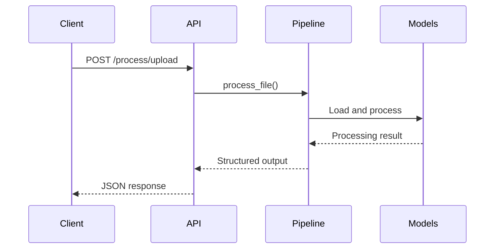
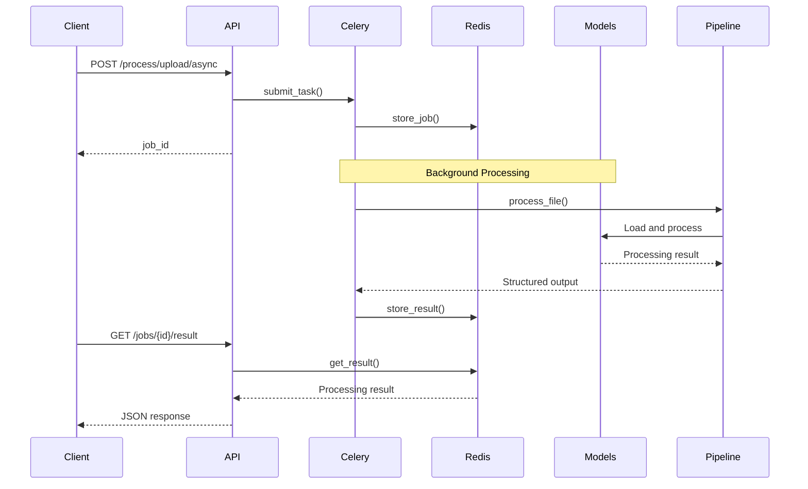
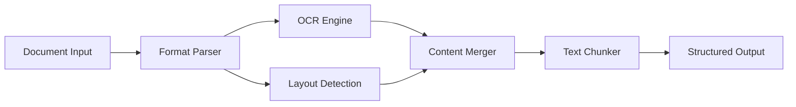

# Architecture Guide

This guide provides an overview of the Document Ingestion API system architecture, components, and design decisions.

## System Overview

The Document Ingestion API is a distributed document processing system built with FastAPI and Celery. It uses IBM's Docling pipeline for advanced document understanding and supports both synchronous and asynchronous processing workflows.



## Core Components

### 1. API Layer (FastAPI)

**Location**: `core/app.py`, `core/api.py`

**Responsibilities:**
- HTTP request handling and routing
- Input validation using Pydantic models
- CORS configuration for cross-origin requests
- Error handling and HTTP status management
- Job submission to background queue

**Key Features:**
- **Sync/Async Endpoints**: Both immediate and background processing
- **File Upload Handling**: Multipart form data processing
- **URL Processing**: Web crawling and document fetching
- **Job Management**: Status tracking and result retrieval

```python
# API endpoint structure
@app.post("/process/upload")           # Synchronous file processing
@app.post("/process/upload/async")     # Asynchronous file processing  
@app.post("/process/url/async")        # Asynchronous URL processing
@app.get("/jobs/{job_id}/status")      # Job status checking
@app.get("/jobs/{job_id}/result")      # Result retrieval
```

### 2. Document Processing Pipeline

**Location**: `core/pipeline.py`

**Responsibilities:**
- Document format detection and conversion
- OCR and text extraction using multiple engines
- Layout analysis and structure detection
- Content chunking for downstream processing
- Model management and device optimization

**Key Components:**
```python
class DocumentIntelligencePipeline:
    - Docling Integration: IBM's document understanding pipeline
    - OCR Engines: EasyOCR and Tesseract support
    - Layout Models: Page structure detection
    - Text Chunking: Semantic text segmentation
    - Device Management: CPU/GPU/MPS optimization
```

**Processing Modes:**
- **Text Only**: Document conversion and formatting only (text extraction)
- **Chunks Only**: Fast chunking for RAG applications (optimized for vector databases)
- **Embedding**: Generate document-level and chunk-level embeddings using nomic-embed-text
- **Full**: All features - text conversion, chunking, and embedding generation

### 3. Background Processing (Celery)

**Location**: `core/celery_app.py`

**Responsibilities:**
- Asynchronous task execution
- Job queue management
- Progress tracking and status updates
- Error handling and retry logic
- Result storage and retrieval

**Task Types:**
```python
@celery_app.task(bind=True)
def process_document_files_task(self, ...)    # File processing
def process_document_url_task(self, ...)      # URL processing  
def process_multiple_urls_task(self, ...)     # Batch processing
def crawl_and_process_urls_task(self, ...)    # Website crawling
```

**Queue Architecture:**
```
Redis Broker (Database 9)  ← Job Submissions
    ↓
Celery Workers             ← Task Execution
    ↓
Redis Backend (Database 10) ← Result Storage
```

### 4. Data Models and Validation

**Location**: `models.py`

**Responsibilities:**
- Request/response schema validation
- Type safety and data consistency
- API documentation generation
- Error message standardization

**Model Hierarchy:**
```python
BaseRequest → ProcessingRequest
              ├── FileUploadRequest
              ├── URLRequest
              ├── BatchURLRequest
              └── CrawlRequest

BaseResponse → ProcessingResponse
               ├── FileResponse
               ├── URLResponse
               ├── BatchResponse
               └── JobResponse
```

### 5. Job Management

**Location**: `job_manager.py`

**Responsibilities:**
- Job status tracking across lifecycle
- Result retrieval with timeout handling
- Error state management
- Performance monitoring

**Job Lifecycle:**
```
PENDING → STARTED → SUCCESS
                 ↘ FAILURE → RETRY
```

## Processing Workflow

### Synchronous Processing Flow



### Asynchronous Processing Flow



## Model Architecture

### Local Model Storage

**Directory Structure:**
```
models/
├── EasyOcr/                          # OCR models (100MB)
│   ├── craft_mlt_25k.pth            # Text detection
│   ├── english_g2.pth               # English recognition
│   └── latin_g2.pth                 # Latin script
├── ds4sd--docling-models/           # Layout models (500MB)
│   ├── layout/                      # Page structure
│   └── tableformer/                 # Table detection
├── ds4sd--DocumentFigureClassifier/ # Figure classification (100MB)
├── ds4sd--CodeFormula/              # Formula detection (500MB)
├── nomic-embed-text-v1.5/           # Text embeddings (500MB)
└── cahya--whisper-medium-id/        # Speech recognition (1.5GB)
```

### Model Loading Strategy

**Singleton Pattern:**
```python
# Lazy loading with caching
_pipeline_instance: Optional[DocumentIntelligencePipeline] = None

def get_pipeline() -> DocumentIntelligencePipeline:
    global _pipeline_instance
    if _pipeline_instance is None:
        _pipeline_instance = DocumentIntelligencePipeline()
    return _pipeline_instance
```

**Device Optimization:**
```python
# Device selection logic
if torch.cuda.is_available() and device == "cuda":
    device = "cuda"
elif torch.backends.mps.is_available() and device == "mps":
    device = "mps"  
else:
    device = "cpu"
```

## Data Flow Architecture

### File Processing Data Flow

```
1. File Upload → Temporary Storage → Validation → Processing → Result
2. URL Fetch → Download → Temporary Storage → Processing → Cleanup → Result
3. Batch Processing → Parallel Downloads → Queue Distribution → Aggregation → Result
4. Web Crawling → URL Discovery → Content Extraction → Batch Processing → Result
```

### Content Processing Pipeline



## Scalability Design

### Horizontal Scaling

**API Server Scaling:**
- Multiple FastAPI instances behind load balancer
- Stateless design enables easy replication
- Shared Redis backend for job coordination

**Worker Scaling:**
- Independent Celery worker processes
- Auto-scaling based on queue length
- Distributed across multiple machines

**Redis Scaling:**
- Redis Cluster for high availability
- Separate databases for queues and results
- Connection pooling for efficiency

### Vertical Scaling

**Resource Optimization:**
- GPU acceleration for model inference
- Memory-mapped model loading
- Efficient chunking algorithms
- Connection pooling and caching

## Security Architecture

### Input Validation

```python
# Multi-layer validation
1. Pydantic Models → Schema validation
2. File Type Checking → Format validation  
3. Size Limits → Resource protection
4. Content Scanning → Security validation
```

### Process Isolation

```python
# Security boundaries
1. Separate user accounts for services
2. Containerized deployment options
3. Network isolation for components
4. Temporary file cleanup
```

### Data Protection

```python
# Data handling
1. Local processing (no external API calls)
2. Temporary file encryption
3. Secure cleanup of sensitive data
4. Access logging and auditing
```

## Configuration Management

### Environment-based Configuration

**Development:**
```env
DEVICE=cpu                    # Stable processing
SERVER_RELOAD=true           # Auto-restart
SERVER_LOG_LEVEL=debug       # Verbose logging
START_CELERY_WORKER=true     # Embedded worker
```

**Production:**
```env
DEVICE=cuda                  # GPU acceleration
SERVER_WORKERS=4             # Multiple processes
SERVER_LOG_LEVEL=info        # Standard logging
START_CELERY_WORKER=false    # Separate workers
```

### Model Configuration

```env
# Model paths and settings
MODELS_DIR=models
TRANSFORMERS_OFFLINE=true
DEFAULT_OCR_ENGINE=easyocr
CHUNK_SIZE=6500
CHUNK_OVERLAP=1640
```

## Performance Considerations

### Latency Optimization

**Sync Processing:**
- Single-threaded for immediate results
- Memory-optimized model loading
- Efficient file I/O operations

**Async Processing:**
- Worker pool distribution
- Parallel processing for batch operations
- Progress tracking without blocking

### Throughput Optimization

**Batch Processing:**
- Parallel URL downloads
- Concurrent document processing
- Efficient result aggregation

**Resource Management:**
- Model sharing across workers
- Memory pool allocation
- GPU memory optimization

### Caching Strategy

**Model Caching:**
- Singleton pipeline instances
- Persistent model loading
- Shared memory for large models

**Result Caching:**
- Redis-based job results
- TTL for temporary data
- Efficient serialization

## Error Handling Architecture

### Error Classification

**System Errors:**
- Model loading failures
- Resource exhaustion
- Network connectivity issues

**User Errors:**
- Invalid file formats
- Malformed requests
- Size limit violations

**Processing Errors:**
- Document corruption
- OCR failures
- Timeout conditions

### Error Recovery Strategy

```python
# Multi-level error handling
1. Input Validation → Early rejection
2. Processing Errors → Retry logic
3. System Errors → Graceful degradation
4. Fatal Errors → Clean shutdown
```

### Monitoring and Alerting

```python
# Error tracking
1. Structured logging → Centralized logs
2. Metrics collection → Performance monitoring
3. Health checks → Service availability
4. Alert thresholds → Proactive response
```

## Future Architecture Considerations

### Scalability Enhancements

- **Microservices**: Split into specialized services
- **Event Streaming**: Apache Kafka for job coordination
- **Container Orchestration**: Kubernetes deployment
- **Auto-scaling**: Dynamic resource allocation

### Performance Optimizations

- **Model Optimization**: ONNX runtime integration
- **Streaming Processing**: Large document handling
- **Edge Computing**: Distributed model inference
- **Caching Layer**: Redis Cluster with persistence

### Feature Extensions

- **Multi-tenancy**: Organization-based isolation
- **API Versioning**: Backward compatibility
- **Plugin Architecture**: Custom processing modules
- **Real-time Processing**: WebSocket integration

For implementation details and deployment guidance, see:
- [Setup Guide](SETUP.md) - Installation and configuration
- [Development Guide](DEVELOPMENT.md) - Development workflow  
- [Deployment Guide](DEPLOYMENT.md) - Production deployment strategies